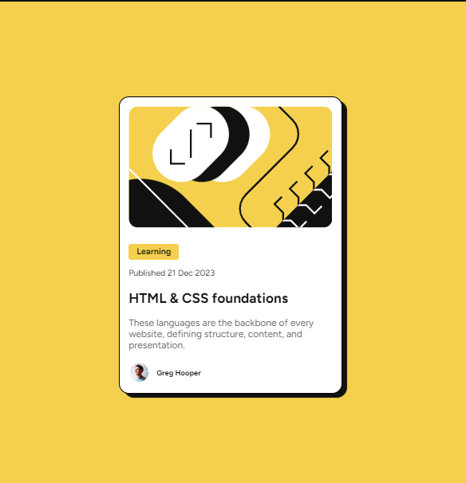

# Frontend Mentor - Blog preview card solution

This is a solution to the [Blog preview card challenge on Frontend Mentor](https://www.frontendmentor.io/challenges/blog-preview-card-ckPaj01IcS). Frontend Mentor challenges help you improve your coding skills by building realistic projects. 

## Table of contents

- [Overview](#overview)
  - [The challenge](#the-challenge)
  - [Screenshot](#screenshot)
  - [Links](#links)
- [My process](#my-process)
  - [Built with](#built-with)
  - [What I learned](#what-i-learned)
  - [Continued development](#continued-development)
  - [Useful resources](#useful-resources)
- [Author](#author)
- [Acknowledgments](#acknowledgments)


## Overview

### The challenge

Users should be able to:

- See hover and focus states for all interactive elements on the page

### Screenshot




## My process

### Built with

- Mobile-first workflow
- Semantic HTML5 markup
- CSS custom properties
- Flexbox


### What I learned

I learnt flex in another way and responsiveness with min and max, ems and rems without using media queries.

To see how you can add code snippets, see below:

```html
  <main>
   <div class="card">
    
    <div class="card-content">
      <div class="first-part">
      <p>Learning</p>
      <p class="published">Published 21 Dec 2023</p>
      <h2>  HTML & CSS foundations</h2>
      <p> These languages are the backbone of every website, defining structure, content, and presentation.</p>
      </div>
      <div class="second-part">
        
        <h3> Greg Hooper</h3>
      </div>
    </div>
   </div>
  </main>
```
```css
.card {
  max-width: 21rem;
  padding: 12px 12px 2px 12px;
  box-sizing: border-box;
  border: 1px solid black;
  border-radius: 15px;
  background-color: var(--white);
  box-shadow: 7px 6px 1px var(--gray-950)
}

.card > img{
    width: 100%;
    border: none;
    border-radius: 15px;
    margin-bottom: 4px;
    image-orientation: -12px;
}

.card-content{
    width: 100%;
    padding: 2px;
    box-sizing: border-box;
}
```


### Useful resources

- [Google Fonts](https://fonts.google.com/selection/embed) - This helped me for getting the right font for this project. I really liked this pattern and will use it going forward.
- [Px vs Ems and Rems](https://fedmentor.dev/posts/font-size-px/) - This is an amazing article which helped me finally understand pxs, ems and rems. I'd recommend it to anyone still learning this concept.


## Author

- Website - [Jude Nwadiogor](https://judesportfolio.netlify.app)


## Acknowledgments

I appreciate frontend mentors for this challenge.
